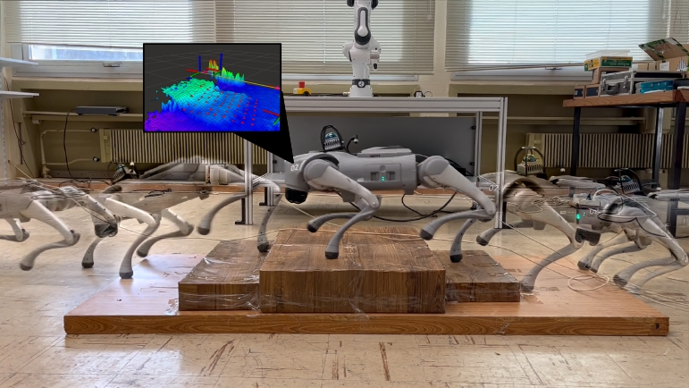
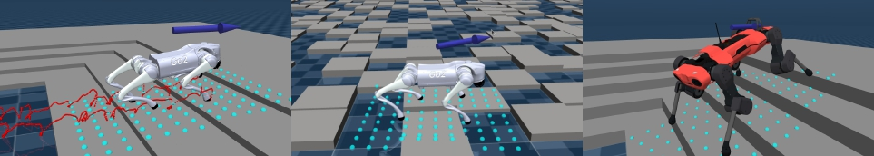
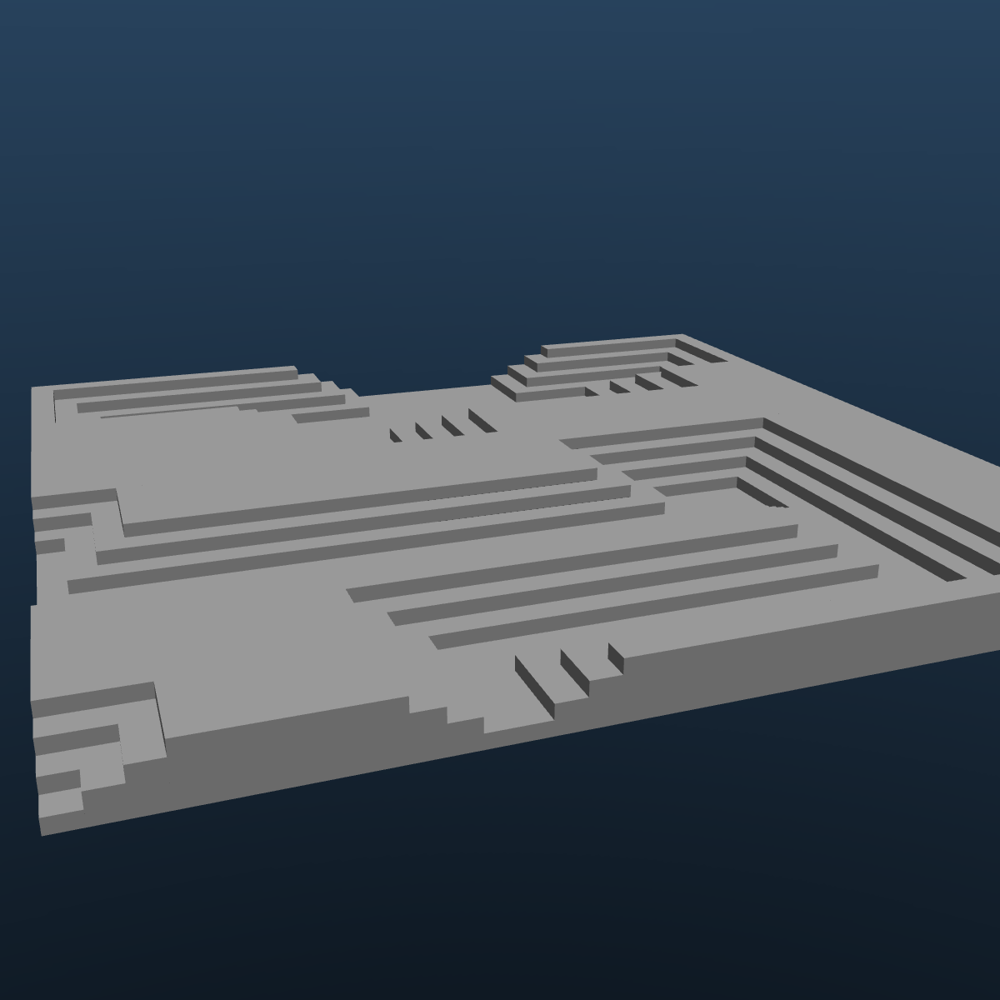
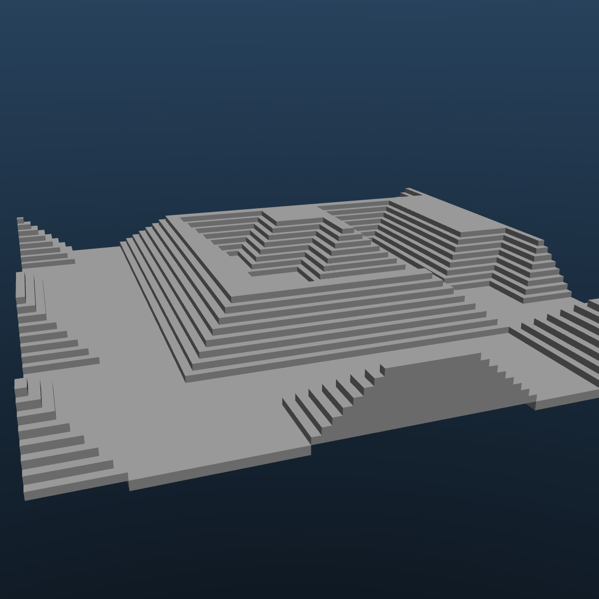
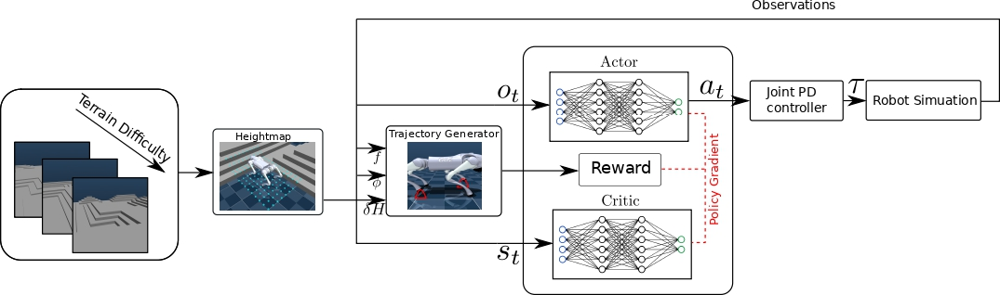

# PGGT
<p align="center">

</p>

A perceptive reinforcement learning locomotion framework developed for the Unitree GO2 in simulation (MuJoco Playground) and deployed using unitree sdk2py, on real hardware.
<p align="center">

</p>

## Terrain Generation
Terrain are produced using Wave Function Collapse in MuJoCo.

<p align="center">
  
  
</p>

## Training Pipeline 

<p align="center">

</p>


## Real World Experiment
The resulting policy deployed in the real world. We use Point-Lio for odometry and Gridmap to extract the desired heightmap.


https://github.com/user-attachments/assets/06f6cd29-2e20-4c2a-a6c7-c1781c9743b1


For more details and/or the full paper contact me at : alex.ntagkas@gmail.com

## Installation

Install the required dependencies:

```bash
pip install mujoco==3.3.0
pip install mujoco_mjx==3.3.0
pip install brax==0.12.1
pip install jax==0.5.0
pip install playground
```
## Training 
To train the policy run the bash file as:
```bash
cd training
./training.sh
```
Additionally you could modify the hyperparameters from inside this file or the training difficulty.
